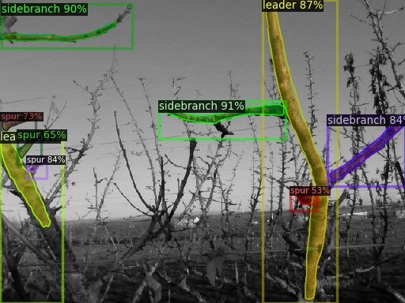
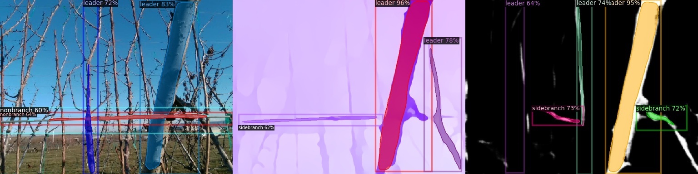
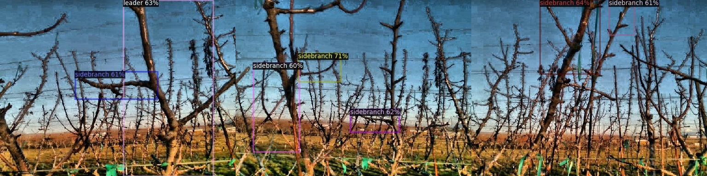

## To Train for Prunning Point Detection
Navigate to prunning_train and run custom_trainv1-4.py depending on your requirements. 
- 1 RGB, MaskRCNN Instance Segmentation
- 2 Augmented Data, Rotation + sheer + noise, FastRCNN, Object Detection
- 3 Mask+opticalflow+depth,  MaskRCNN Instance Segmentation
- 4 Stacked Mask,Opticalflow,Depth, image size (:,:,4)  MaskRCNN Instance Segmentation
-  
```
python custom_train.py
```
Video demonstration of Pruning 


The output of RGB segmentation 



The output using the mask+opticalflow+depth model 



The output using the Augmented Data 




## About Dectectron2


Detectron2 is Facebook AI Research's next generation library
that provides state-of-the-art detection and segmentation algorithms.
It is the successor of
[Detectron](https://github.com/facebookresearch/Detectron/)
and [maskrcnn-benchmark](https://github.com/facebookresearch/maskrcnn-benchmark/).
It supports a number of computer vision research projects and production applications in Facebook.


## License

Detectron2 is released under the [Apache 2.0 license](LICENSE).

## Citing Detectron2

If you use Detectron2 in your research or wish to refer to the baseline results published in the [Model Zoo](MODEL_ZOO.md), please use the following BibTeX entry.

```BibTeX
@misc{wu2019detectron2,
  author =       {Yuxin Wu and Alexander Kirillov and Francisco Massa and
                  Wan-Yen Lo and Ross Girshick},
  title =        {Detectron2},
  howpublished = {\url{https://github.com/facebookresearch/detectron2}},
  year =         {2019}
}
```
